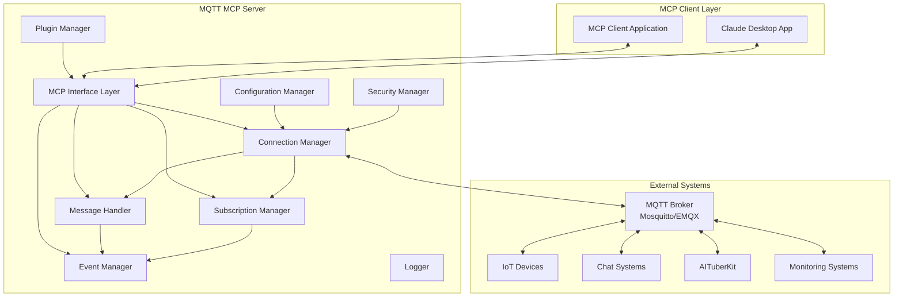

# MQTT MCP Server 技術要件仕様書

## 1. 技術概要

### 1.1 システムアーキテクチャ


### 1.2 技術スタック
| レイヤー | 技術 | バージョン | 備考 |
|---------|------|-----------|------|
| ランタイム | Node.js | v18+ | LTS版推奨 |
| 言語 | TypeScript | v5.0+ | 型安全性確保 |
| MCP SDK | @modelcontextprotocol/sdk | latest | MCP仕様準拠 |
| MQTT Client | mqtt.js | v5.0+ | MQTT v3.1.1/v5.0対応 |
| ログ | winston | v3.0+ | 構造化ログ |
| テスト | Jest + Supertest | latest | 単体・統合テスト |
| 設定管理 | cosmiconfig | latest | 多形式設定サポート |
| 暗号化 | node:crypto | Built-in | 認証情報暗号化 |

## 2. 機能要件詳細

### 2.1 MQTT接続管理機能

#### FR-001: マルチブローカー接続
```typescript
interface ConnectionManager {
  // 接続管理
  connect(config: BrokerConfig): Promise<ConnectionResult>;
  disconnect(brokerId: string): Promise<void>;
  reconnect(brokerId: string): Promise<ConnectionResult>;
  
  // 状態管理
  getStatus(brokerId?: string): ConnectionStatus[];
  isConnected(brokerId: string): boolean;
  
  // 接続プール
  getConnection(brokerId: string): MQTTConnection | null;
  getAllConnections(): Map<string, MQTTConnection>;
}

interface BrokerConfig {
  id: string;
  url: string;
  port?: number;
  protocol: 'mqtt' | 'mqtts' | 'ws' | 'wss';
  clientId?: string;
  username?: string;
  password?: string;
  keepalive?: number;
  clean?: boolean;
  reconnectPeriod?: number;
  connectTimeout?: number;
  will?: LWTConfig;
}
```

#### FR-002: 自動再接続機能
```typescript
interface ReconnectStrategy {
  enabled: boolean;
  initialDelay: number;      // 初期遅延 (ms)
  maxDelay: number;          // 最大遅延 (ms)
  backoffMultiplier: number; // 指数バックオフ倍率
  maxAttempts: number;       // 最大試行回数
  jitter: boolean;           // ランダムジッター有効化
}
```

### 2.2 メッセージング機能

#### FR-010: 高性能メッセージ処理
```typescript
interface MessageHandler {
  // Publish
  publish(params: PublishParams): Promise<PublishResult>;
  publishBatch(messages: PublishParams[]): Promise<BatchPublishResult>;
  
  // QoS処理
  handleQoS0(message: MQTTMessage): void;
  handleQoS1(message: MQTTMessage): Promise<void>;
  handleQoS2(message: MQTTMessage): Promise<void>;
  
  // メッセージ変換
  transformMessage(message: any, format: MessageFormat): Buffer;
  parseMessage(payload: Buffer, format: MessageFormat): any;
}

interface PublishParams {
  brokerId?: string;
  topic: string;
  message: any;
  qos?: 0 | 1 | 2;
  retain?: boolean;
  properties?: MessageProperties; // MQTT v5.0
}
```

#### FR-011: 購読管理機能
```typescript
interface SubscriptionManager {
  // 購読操作
  subscribe(params: SubscribeParams): Promise<SubscribeResult>;
  unsubscribe(params: UnsubscribeParams): Promise<void>;
  subscribeMultiple(subscriptions: SubscribeParams[]): Promise<BatchSubscribeResult>;
  
  // 購読状態管理
  getSubscriptions(brokerId?: string): Subscription[];
  isSubscribed(topic: string, brokerId?: string): boolean;
  
  // メッセージルーティング
  routeMessage(topic: string, message: MQTTMessage): void;
  addMessageFilter(filter: MessageFilter): void;
}

interface SubscribeParams {
  brokerId?: string;
  topic: string;
  qos?: 0 | 1 | 2;
  nl?: boolean;  // No Local (MQTT v5.0)
  rap?: boolean; // Retain as Published (MQTT v5.0)
  rh?: number;   // Retain Handling (MQTT v5.0)
}
```

### 2.3 MCPインターフェース機能

#### FR-020: MCPツール実装
```typescript
interface MCPTools {
  // 接続管理ツール
  mqtt_connect: Tool<ConnectParams, ConnectResult>;
  mqtt_disconnect: Tool<DisconnectParams, DisconnectResult>;
  mqtt_status: Tool<StatusParams, StatusResult>;
  
  // メッセージングツール
  mqtt_publish: Tool<PublishParams, PublishResult>;
  mqtt_subscribe: Tool<SubscribeParams, SubscribeResult>;
  mqtt_unsubscribe: Tool<UnsubscribeParams, UnsubscribeResult>;
  
  // 管理ツール
  mqtt_list_subscriptions: Tool<ListParams, SubscriptionList>;
  mqtt_get_messages: Tool<GetMessagesParams, MessageHistory>;
  mqtt_add_subscriptions: Tool<AddSubscriptionsParams, BatchSubscribeResult>;
  mqtt_remove_subscriptions: Tool<RemoveSubscriptionsParams, BatchUnsubscribeResult>;
}
```

#### FR-021: MCPリソース実装
```typescript
interface MCPResources {
  // 接続情報リソース
  'mqtt://connections': Resource<ConnectionInfo[]>;
  
  // 購読情報リソース  
  'mqtt://subscriptions': Resource<SubscriptionInfo[]>;
  'mqtt://subscriptions/{brokerId}': Resource<SubscriptionInfo[]>;
  
  // メッセージ履歴リソース
  'mqtt://messages': Resource<MessageHistory>;
  'mqtt://messages/{brokerId}': Resource<MessageHistory>;
  'mqtt://messages/{brokerId}/{topic}': Resource<TopicMessageHistory>;
  
  // 統計情報リソース
  'mqtt://metrics': Resource<SystemMetrics>;
  'mqtt://health': Resource<HealthStatus>;
}
```

#### FR-022: MCPイベント通知
```typescript
interface MCPEvents {
  // メッセージ受信イベント
  mqtt_message: MCPEvent<MessageEventData>;
  
  // 接続状態変更イベント
  mqtt_connection: MCPEvent<ConnectionEventData>;
  
  // エラーイベント
  mqtt_error: MCPEvent<ErrorEventData>;
  
  // 購読状態変更イベント
  mqtt_subscription: MCPEvent<SubscriptionEventData>;
}
```

### 2.4 設定管理機能

#### FR-030: 多層設定管理
```typescript
interface ConfigurationManager {
  // 設定読み込み
  loadConfig(): Promise<SystemConfig>;
  loadFromFile(path: string): Promise<Partial<SystemConfig>>;
  loadFromEnvironment(): Partial<SystemConfig>;
  
  // 設定アクセス
  get<T>(key: string, defaultValue?: T): T;
  set(key: string, value: any): void;
  has(key: string): boolean;
  
  // 設定検証
  validate(config: Partial<SystemConfig>): ValidationResult;
  
  // 動的更新
  watch(callback: ConfigChangeCallback): void;
  reload(): Promise<void>;
}

interface SystemConfig {
  mcp: MCPConfig;
  mqtt: MQTTConfig;
  security: SecurityConfig;
  logging: LoggingConfig;
  monitoring: MonitoringConfig;
  plugins: PluginConfig[];
}
```

## 3. 非機能要件詳細

### 3.1 性能要件

#### NFR-001: レスポンス性能
```typescript
interface PerformanceRequirements {
  // 応答時間
  mqttPublishLatency: 50;      // ms (P95)
  mcpToolCallLatency: 100;     // ms (P95)
  connectionEstablishment: 5000; // ms (max)
  
  // スループット
  messagesPerSecond: 1000;     // QoS 0
  concurrentConnections: 100;   // 同時接続数
  subscriptionsPerConnection: 50; // 1接続あたりの購読数
  
  // リソース使用量
  memoryUsage: 512 * 1024 * 1024; // 512MB
  cpuUsage: 80;                   // % (sustained)
}
```

#### NFR-002: スケーラビリティ
```typescript
interface ScalabilityStrategy {
  // 水平スケーリング
  loadBalancing: {
    strategy: 'round-robin' | 'least-connections' | 'weighted';
    healthCheck: boolean;
    failover: boolean;
  };
  
  // 接続プーリング
  connectionPooling: {
    minConnections: number;
    maxConnections: number;
    acquireTimeout: number;
    idleTimeout: number;
  };
  
  // メッセージバッファリング
  messageBuffering: {
    bufferSize: number;
    flushInterval: number;
    backpressureThreshold: number;
  };
}
```

### 3.2 可用性要件

#### NFR-010: 高可用性設計
```typescript
interface AvailabilityStrategy {
  // 目標稼働率
  targetUptime: 99.9; // %
  
  // 障害復旧
  mttr: 5 * 60; // 5分 (seconds)
  rto: 1 * 60;  // 1分 (seconds)
  rpo: 0;       // データ損失ゼロ
  
  // ヘルスチェック
  healthCheck: {
    interval: 30; // seconds
    timeout: 5;   // seconds
    retries: 3;
  };
  
  // サーキットブレーカー
  circuitBreaker: {
    failureThreshold: 5;
    recoveryTimeout: 30; // seconds
    monitoringPeriod: 60; // seconds
  };
}
```

### 3.3 セキュリティ要件

#### NFR-020: セキュリティ実装
```typescript
interface SecurityImplementation {
  // 通信暗号化
  encryption: {
    tls: {
      minVersion: 'TLSv1.2';
      cipherSuites: string[];
      certificateValidation: boolean;
    };
    applicationLevel: {
      messageEncryption: boolean;
      keyRotation: boolean;
    };
  };
  
  // 認証・認可
  authentication: {
    methods: ('username-password' | 'certificate' | 'token')[];
    tokenExpiry: number;
    mfa: boolean;
  };
  
  authorization: {
    rbac: boolean;
    topicACL: boolean;
    resourceACL: boolean;
  };
  
  // 監査
  auditing: {
    connectionLogs: boolean;
    messageLogs: boolean;
    errorLogs: boolean;
    retentionPeriod: number; // days
  };
}
```

## 4. 技術設計詳細

### 4.1 データモデル

#### 接続情報
```typescript
interface ConnectionInfo {
  id: string;
  config: BrokerConfig;
  status: ConnectionStatus;
  metrics: ConnectionMetrics;
  createdAt: Date;
  connectedAt?: Date;
  lastActivity: Date;
}

interface ConnectionMetrics {
  messagesSent: number;
  messagesReceived: number;
  bytesTransferred: number;
  errorCount: number;
  reconnectCount: number;
  averageLatency: number;
}
```

#### メッセージ履歴
```typescript
interface MessageHistory {
  messages: HistoricalMessage[];
  totalCount: number;
  filteredCount: number;
  pagination: {
    offset: number;
    limit: number;
    hasMore: boolean;
  };
}

interface HistoricalMessage {
  id: string;
  brokerId: string;
  topic: string;
  payload: any;
  qos: 0 | 1 | 2;
  retain: boolean;
  timestamp: Date;
  size: number;
}
```

### 4.2 エラーハンドリング

#### エラー分類体系
```typescript
enum ErrorCategory {
  CONNECTION_ERROR = 'CONNECTION_ERROR',
  AUTHENTICATION_ERROR = 'AUTHENTICATION_ERROR', 
  AUTHORIZATION_ERROR = 'AUTHORIZATION_ERROR',
  PROTOCOL_ERROR = 'PROTOCOL_ERROR',
  VALIDATION_ERROR = 'VALIDATION_ERROR',
  TIMEOUT_ERROR = 'TIMEOUT_ERROR',
  RESOURCE_ERROR = 'RESOURCE_ERROR',
  INTERNAL_ERROR = 'INTERNAL_ERROR'
}

class MQTTMCPError extends Error {
  readonly category: ErrorCategory;
  readonly code: string;
  readonly statusCode: number;
  readonly details?: any;
  readonly timestamp: Date;
  readonly context?: ErrorContext;

  constructor(
    category: ErrorCategory,
    code: string,
    message: string,
    statusCode: number = 500,
    details?: any,
    context?: ErrorContext
  ) {
    super(message);
    this.category = category;
    this.code = code;
    this.statusCode = statusCode;
    this.details = details;
    this.timestamp = new Date();
    this.context = context;
    this.name = 'MQTTMCPError';
  }
}
```

### 4.3 ログ設計

#### 構造化ログ
```typescript
interface LogEntry {
  timestamp: string;     // ISO 8601
  level: LogLevel;
  message: string;
  component: string;
  operation?: string;
  correlationId?: string;
  brokerId?: string;
  topic?: string;
  duration?: number;     // ms
  error?: {
    name: string;
    message: string;
    stack?: string;
    code?: string;
  };
  metadata?: Record<string, any>;
}

enum LogLevel {
  DEBUG = 0,
  INFO = 1,
  WARN = 2,
  ERROR = 3
}
```

### 4.4 メトリクス設計

#### システムメトリクス
```typescript
interface SystemMetrics {
  // システム基本情報
  system: {
    uptime: number;        // seconds
    version: string;
    nodeVersion: string;
    platform: string;
    arch: string;
  };
  
  // リソース使用状況
  resources: {
    memory: {
      used: number;        // bytes
      total: number;       // bytes
      percentage: number;  // %
    };
    cpu: {
      usage: number;       // %
      loadAverage: number[];
    };
  };
  
  // MQTT統計
  mqtt: {
    connections: {
      total: number;
      active: number;
      failed: number;
    };
    messages: {
      sent: number;
      received: number;
      dropped: number;
      queued: number;
    };
    subscriptions: {
      total: number;
      active: number;
    };
  };
  
  // MCP統計
  mcp: {
    toolCalls: {
      total: number;
      success: number;
      error: number;
      averageLatency: number;
    };
    events: {
      sent: number;
      queued: number;
    };
  };
}
```

## 5. 実装ガイドライン

### 5.1 コード品質基準

#### TypeScript設定
```json
{
  "compilerOptions": {
    "target": "ES2022",
    "module": "commonjs",
    "lib": ["ES2022"],
    "strict": true,
    "noImplicitAny": true,
    "strictNullChecks": true,
    "strictFunctionTypes": true,
    "noImplicitReturns": true,
    "noImplicitThis": true,
    "noUnusedLocals": true,
    "noUnusedParameters": true,
    "exactOptionalPropertyTypes": true
  }
}
```

#### ESLint設定
```json
{
  "extends": [
    "@typescript-eslint/recommended",
    "prettier"
  ],
  "rules": {
    "no-console": "warn",
    "prefer-const": "error",
    "no-var": "error",
    "@typescript-eslint/no-unused-vars": "error",
    "@typescript-eslint/explicit-function-return-type": "warn",
    "@typescript-eslint/no-explicit-any": "warn"
  }
}
```

### 5.2 テスト戦略

#### テストピラミッド
```typescript
// 単体テスト (70%)
describe('ConnectionManager', () => {
  it('should establish connection successfully', async () => {
    const manager = new ConnectionManager(mockConfig);
    const result = await manager.connect(brokerConfig);
    expect(result.success).toBe(true);
  });
});

// 統合テスト (20%)
describe('MQTT Message Flow', () => {
  it('should publish and receive messages end-to-end', async () => {
    // Test with real MQTT broker
  });
});

// E2Eテスト (10%) 
describe('MCP Integration', () => {
  it('should work with Claude Desktop', async () => {
    // Test with actual MCP client
  });
});
```

### 5.3 セキュリティガイドライン

#### 認証情報管理
```typescript
class SecureCredentialManager {
  private cryptoKey: Buffer;
  
  constructor(keyPath: string) {
    this.cryptoKey = this.loadKey(keyPath);
  }
  
  encrypt(plaintext: string): string {
    const cipher = crypto.createCipher('aes-256-gcm', this.cryptoKey);
    let encrypted = cipher.update(plaintext, 'utf8', 'hex');
    encrypted += cipher.final('hex');
    return encrypted;
  }
  
  decrypt(encrypted: string): string {
    const decipher = crypto.createDecipher('aes-256-gcm', this.cryptoKey);
    let decrypted = decipher.update(encrypted, 'hex', 'utf8');
    decrypted += decipher.final('utf8');
    return decrypted;
  }
}
```

## 6. デプロイメント要件

### 6.1 Docker設定
```dockerfile
FROM node:18-alpine AS builder
WORKDIR /app
COPY package*.json ./
RUN npm ci --only=production

FROM node:18-alpine AS runtime
WORKDIR /app
COPY --from=builder /app/node_modules ./node_modules
COPY dist/ ./dist/
COPY config/ ./config/

EXPOSE 3000
HEALTHCHECK --interval=30s --timeout=5s --start-period=10s --retries=3 \
  CMD curl -f http://localhost:3000/health || exit 1

USER node
CMD ["node", "dist/index.js"]
```

### 6.2 Kubernetes設定
```yaml
apiVersion: apps/v1
kind: Deployment
metadata:
  name: mqtt-mcp-server
spec:
  replicas: 3
  strategy:
    type: RollingUpdate
    rollingUpdate:
      maxSurge: 1
      maxUnavailable: 0
  template:
    spec:
      containers:
      - name: mqtt-mcp-server
        image: mqtt-mcp-server:latest
        ports:
        - containerPort: 3000
        env:
        - name: NODE_ENV
          value: "production"
        resources:
          requests:
            memory: "256Mi"
            cpu: "250m"
          limits:
            memory: "512Mi"
            cpu: "500m"
        readinessProbe:
          httpGet:
            path: /health
            port: 3000
          initialDelaySeconds: 10
          periodSeconds: 5
        livenessProbe:
          httpGet:
            path: /health
            port: 3000
          initialDelaySeconds: 30
          periodSeconds: 10
```

## 7. 監視・運用要件

### 7.1 ヘルスチェック
```typescript
interface HealthCheck {
  status: 'healthy' | 'degraded' | 'unhealthy';
  timestamp: string;
  checks: {
    mqtt: ComponentHealth;
    mcp: ComponentHealth;
    memory: ComponentHealth;
    disk: ComponentHealth;
  };
  uptime: number;
  version: string;
}

interface ComponentHealth {
  status: 'up' | 'down' | 'degraded';
  responseTime?: number;
  error?: string;
  details?: any;
}
```

### 7.2 アラート設定
```yaml
alerts:
  - name: mqtt_connection_down
    condition: mqtt_connections_active == 0
    severity: critical
    
  - name: high_memory_usage
    condition: memory_usage > 0.8
    severity: warning
    
  - name: message_queue_full
    condition: message_queue_size > 1000
    severity: warning
    
  - name: high_error_rate
    condition: error_rate > 0.05
    severity: warning
```

---

**版数**: 1.0  
**作成日**: 2024年12月15日  
**承認者**: 技術リード  
**次回レビュー**: 2025年3月15日