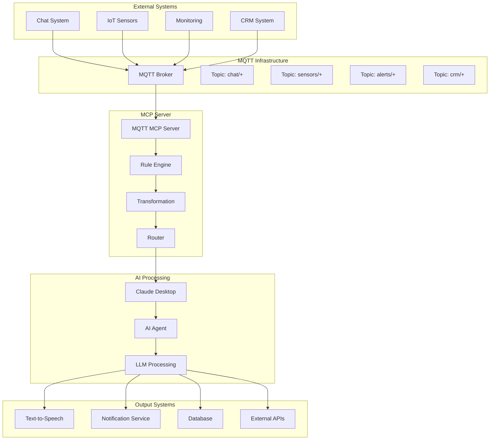
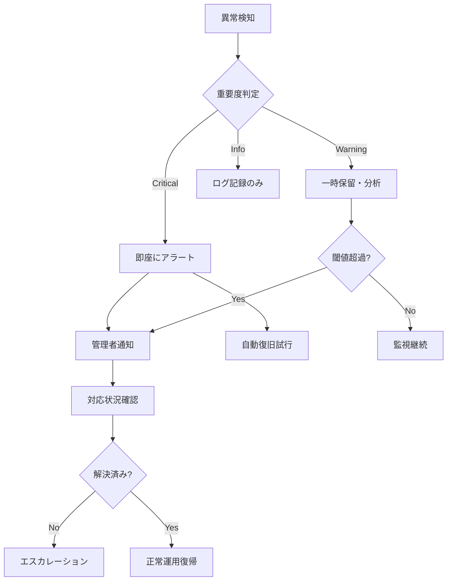

# MQTT MCP Server ユースケース設計書

## 1. ユースケース概要

本書では、MQTT MCP Serverの実用的なユースケースを、ユーザーシナリオ、システム統合パターン、および実装例とともに定義します。特にAITuberKitとの統合を中心とした具体的な利用場面を詳述します。

## 2. ユーザーペルソナ

### 2.1 プライマリペルソナ

#### AITuber開発者（田中さん）
- **背景**: VTuberコンテンツ制作者、プログラミング経験あり
- **目標**: チャット、監視システム、IoTセンサーからの発話要求を統合
- **課題**: 複数システムからの入力を効率的に処理したい
- **スキル**: JavaScript/TypeScript、基本的なサーバー運用

#### エンタープライズIoT開発者（山田さん）
- **背景**: 製造業のIoTソリューション開発者
- **目標**: MQTTデータをLLMで分析・応答生成
- **課題**: MQTTとAIサービスの統合に手間がかかる
- **スキル**: Python/Node.js、MQTT、クラウドサービス

### 2.2 セカンダリペルソナ

#### システムインテグレーター（佐藤さん）
- **背景**: 企業向けシステム統合専門
- **目標**: 既存MQTTシステムへのAI機能追加
- **課題**: 複雑な統合作業の簡素化
- **スキル**: 多様な技術スタック、システム設計

## 3. メインユースケース

### 3.1 AITuberKitとの統合

#### UC-001: マルチソース発話統合システム

**ユーザーストーリー**:
「AITuber開発者として、チャット、アラート、IoTセンサーからの情報を統一的に音声発話に変換したい」

**詳細シナリオ**:
1. **環境構築** (5分)
   ```bash
   # MQTT MCP Serverのセットアップ
   npm install -g mqtt-mcp-server
   mqtt-mcp-server init --template aituber
   ```

2. **複数ソースの設定** (10分)
   ```json
   {
     "sources": [
       {
         "name": "chat-system",
         "broker": "mqtt://chat-server:1883",
         "topics": ["chat/messages/+", "chat/moderator/+"]
       },
       {
         "name": "monitoring",  
         "broker": "mqtt://monitor:1883",
         "topics": ["alerts/critical", "alerts/warning"]
       },
       {
         "name": "iot-sensors",
         "broker": "mqtt://iot-hub:1883", 
         "topics": ["sensors/+/temperature", "sensors/+/humidity"]
       }
     ]
   }
   ```

3. **発話ルール設定** (15分)
   ```typescript
   // 発話優先度とスタイル設定
   const speechRules = {
     'alerts/critical': {
       priority: 'interrupt',
       voice: 'urgent',
       template: '緊急アラート: {{message}}'
     },
     'chat/messages/+': {
       priority: 'normal', 
       voice: 'friendly',
       template: '{{username}}さんからのメッセージ: {{text}}'
     },
     'sensors/+/temperature': {
       priority: 'low',
       voice: 'informative',
       condition: 'value > 30',
       template: '{{location}}の温度が{{value}}度になりました'
     }
   };
   ```

4. **Claude Desktop統合** (5分)
   ```json
   {
     "mcpServers": {
       "mqtt-aituber": {
         "command": "mqtt-mcp-server",
         "args": ["--config", "aituber-config.json"]
       }
     }
   }
   ```

**期待される結果**:
- 複数ソースからの情報が優先度に従って発話される
- アラートは即座に割り込み発話
- チャットメッセージは順次処理
- センサーデータは条件付きで発話

**成功指標**:
- 95%以上のメッセージが5秒以内に処理される
- アラート発話の遅延が1秒以内
- システム稼働率99.5%以上

---

### 3.2 スマートホーム監視システム

#### UC-002: IoTデバイス異常検知・通知システム

**ユーザーストーリー**:
「システム管理者として、IoTデバイスの異常を自動検知し、適切な対応指示をAIで生成したい」

**詳細シナリオ**:
1. **デバイス接続** (設定: 30分)
   ```javascript
   // 温度・湿度・照度・人感センサーなど20台のデバイス
   const devices = [
     { id: 'temp-01', type: 'temperature', location: 'living-room' },
     { id: 'humidity-01', type: 'humidity', location: 'living-room' },
     { id: 'motion-01', type: 'motion', location: 'entrance' },
     // ... 他17台
   ];
   ```

2. **異常検知ルール** (設定: 45分)
   ```typescript
   const anomalyRules = [
     {
       pattern: 'sensors/+/temperature',
       condition: 'value > 35 || value < 0',
       action: 'generate-maintenance-alert',
       aiPrompt: 'Temperature sensor {{sensorId}} shows {{value}}°C at {{location}}. Provide maintenance recommendation.'
     },
     {
       pattern: 'sensors/+/battery',
       condition: 'level < 0.2',
       action: 'schedule-battery-replacement',
       aiPrompt: 'Battery level for {{sensorId}} is {{level}}%. Generate replacement schedule.'
     }
   ];
   ```

3. **AI応答生成** (運用: 24時間)
   ```typescript
   // Claude Desktopでの自動応答生成
   mcp.on('mqtt_message', async (event) => {
     const { topic, message } = event.data;
     
     if (matchesAnomalyRule(topic, message)) {
       const aiResponse = await claude.generate({
         prompt: buildPrompt(topic, message),
         context: getDeviceHistory(extractDeviceId(topic))
       });
       
       await notifyMaintenance(aiResponse);
       await updateDeviceStatus(extractDeviceId(topic), 'attention-required');
     }
   });
   ```

**期待される結果**:
- デバイス異常を3分以内に検知
- AIによる対応指示が5分以内に生成
- 保守スケジュールの自動更新
- 履歴データに基づく予測保守提案

---

### 3.3 リアルタイムカスタマーサポート

#### UC-003: チャットボット・有人サポート連携システム

**ユーザーストーリー**:
「カスタマーサポート担当者として、チャットボットでは対応困難な問い合わせを効率的にエスカレーションしたい」

**詳細シナリオ**:
1. **マルチチャネル統合** (設定: 60分)
   ```json
   {
     "channels": [
       {
         "name": "website-chat",
         "broker": "mqtt://web-server:1883",
         "topics": ["support/chat/+"]
       },
       {
         "name": "mobile-app", 
         "broker": "mqtt://app-server:1883",
         "topics": ["support/mobile/+"]
       },
       {
         "name": "email-integration",
         "broker": "mqtt://email-gateway:1883", 
         "topics": ["support/email/+"]
       }
     ]
   }
   ```

2. **インテリジェントルーティング** (設定: 90分)
   ```typescript
   const routingLogic = {
     // AI判定によるエスカレーション
     escalationTriggers: [
       'sentiment_score < -0.5',    // 感情スコアが低い
       'complexity_score > 0.8',    // 複雑な問い合わせ
       'keyword_match: ["refund", "complaint", "legal"]',
       'conversation_length > 10'   // 長時間の会話
     ],
     
     // スキルベースルーティング
     agentSkills: {
       'technical': ['api', 'integration', 'troubleshooting'],
       'billing': ['payment', 'refund', 'subscription'],
       'general': ['account', 'features', 'howto']
     }
   };
   ```

3. **リアルタイム分析・支援** (運用: 営業時間中)
   ```typescript
   // 会話の感情分析とサポート支援
   mcp.on('mqtt_message', async (event) => {
     const message = event.data.message;
     
     // 感情分析
     const sentiment = await analyzeSentiment(message.text);
     
     // 複雑度判定
     const complexity = await assessComplexity(message.text, message.context);
     
     // エスカレーション判定
     if (shouldEscalate(sentiment, complexity)) {
       await escalateToHuman({
         customer: message.customerId,
         issue: message.text,
         context: message.conversationHistory,
         priority: calculatePriority(sentiment, complexity),
         suggestedAgent: selectBestAgent(message.category)
       });
     } else {
       // AIによる自動回答生成
       const response = await generateResponse(message);
       await sendResponse(message.customerId, response);
     }
   });
   ```

**期待される結果**:
- 90%以上の簡単な問い合わせが自動解決
- エスカレーション判定の精度95%以上
- 平均応答時間30秒以内
- 顧客満足度の15%向上

---

## 4. 技術統合パターン

### 4.1 イベント駆動アーキテクチャパターン



### 4.2 マイクロサービス統合パターン

```typescript
// サービス発見とロードバランシング
interface ServiceRegistry {
  registerService(service: ServiceInfo): void;
  discoverServices(type: string): ServiceInfo[];
  healthCheck(serviceId: string): Promise<boolean>;
}

// メッセージ変換パターン
interface MessageTransformer {
  transform(input: RawMessage): ProcessedMessage;
  validate(message: any): ValidationResult;
  enrich(message: ProcessedMessage): EnrichedMessage;
}

// 設定駆動ルーティング
interface RoutingConfig {
  routes: Route[];
  fallback: string;
  timeout: number;
}

interface Route {
  pattern: string;
  destination: string;
  transformation?: string;
  condition?: string;
}
```

## 5. 実装テンプレート

### 5.1 AITuberKit統合テンプレート

```typescript
// aituber-integration.ts
import { MCPServer } from '@modelcontextprotocol/sdk/server/index.js';
import { MQTTManager } from './mqtt-manager.js';
import { SpeechPriority, VoiceStyle } from './types.js';

export class AITuberIntegration {
  private mcpServer: MCPServer;
  private mqttManager: MQTTManager;
  private speechQueue: PriorityQueue<SpeechRequest>;

  constructor(config: AITuberConfig) {
    this.mcpServer = new MCPServer({ name: 'aituber-mqtt' });
    this.mqttManager = new MQTTManager(config.mqtt);
    this.speechQueue = new PriorityQueue();
    
    this.setupTools();
    this.setupMessageHandlers();
  }

  private setupTools(): void {
    // 発話ツール
    this.mcpServer.setRequestHandler(ListToolsRequestSchema, async () => ({
      tools: [
        {
          name: 'speak',
          description: 'Convert text to speech with emotion and priority',
          inputSchema: {
            type: 'object',
            properties: {
              text: { type: 'string', description: 'Text to speak' },
              emotion: { 
                type: 'string', 
                enum: ['happy', 'sad', 'excited', 'calm', 'urgent'],
                default: 'neutral'
              },
              priority: {
                type: 'string',
                enum: ['low', 'normal', 'high', 'interrupt'],
                default: 'normal'
              },
              source: { type: 'string', description: 'Source system identifier' }
            },
            required: ['text']
          }
        },
        {
          name: 'configure_speech_rules',
          description: 'Configure automatic speech generation rules',
          inputSchema: {
            type: 'object',
            properties: {
              rules: {
                type: 'array',
                items: {
                  type: 'object',
                  properties: {
                    topicPattern: { type: 'string' },
                    condition: { type: 'string' },
                    template: { type: 'string' },
                    priority: { type: 'string' },
                    emotion: { type: 'string' }
                  }
                }
              }
            }
          }
        }
      ]
    }));

    // 発話実行
    this.mcpServer.setRequestHandler(CallToolRequestSchema, async (request) => {
      switch (request.params.name) {
        case 'speak':
          return this.handleSpeakRequest(request.params.arguments);
        case 'configure_speech_rules':
          return this.configureSpeechRules(request.params.arguments);
        default:
          throw new Error(`Unknown tool: ${request.params.name}`);
      }
    });
  }

  private setupMessageHandlers(): void {
    // MQTTメッセージの自動音声化
    this.mqttManager.on('message', async (topic: string, message: any) => {
      const speechRule = this.findMatchingRule(topic);
      if (speechRule) {
        const speechRequest = this.buildSpeechRequest(speechRule, message);
        await this.enqueueSpeech(speechRequest);
      }
    });

    // 音声キューの処理
    setInterval(() => {
      this.processSpeechQueue();
    }, 100); // 100ms間隔で処理
  }

  private async handleSpeakRequest(args: any): Promise<any> {
    const speechRequest: SpeechRequest = {
      text: args.text,
      emotion: args.emotion || 'neutral',
      priority: this.parsePriority(args.priority || 'normal'),
      source: args.source || 'manual',
      timestamp: Date.now()
    };

    await this.enqueueSpeech(speechRequest);
    
    return {
      content: [{
        type: 'text',
        text: `Speech request enqueued: "${args.text}" with ${args.priority} priority`
      }]
    };
  }

  private findMatchingRule(topic: string): SpeechRule | null {
    return this.speechRules.find(rule => 
      this.matchesPattern(topic, rule.topicPattern)
    ) || null;
  }

  private buildSpeechRequest(rule: SpeechRule, message: any): SpeechRequest {
    const text = this.applyTemplate(rule.template, message);
    
    return {
      text,
      emotion: rule.emotion,
      priority: rule.priority,
      source: message.source || 'mqtt',
      timestamp: Date.now(),
      metadata: {
        topic: message.topic,
        originalMessage: message
      }
    };
  }

  private async enqueueSpeech(request: SpeechRequest): Promise<void> {
    // 割り込み優先度の場合は現在の発話を停止
    if (request.priority === SpeechPriority.INTERRUPT) {
      await this.stopCurrentSpeech();
      this.speechQueue.clear();
    }
    
    this.speechQueue.enqueue(request, request.priority);
  }

  private async processSpeechQueue(): Promise<void> {
    if (this.speechQueue.isEmpty() || this.isSpeaking()) {
      return;
    }

    const request = this.speechQueue.dequeue();
    if (request) {
      await this.executeSpeech(request);
    }
  }

  private async executeSpeech(request: SpeechRequest): Promise<void> {
    try {
      // AITuberKitのTTS APIを呼び出し
      await this.aituberKit.speak({
        text: request.text,
        emotion: request.emotion,
        voice: this.getVoiceStyle(request.emotion)
      });

      // 統計情報更新
      this.updateSpeechStats(request);
      
    } catch (error) {
      console.error('Speech execution failed:', error);
      // エラー通知
      await this.notifyError(error, request);
    }
  }
}

// 使用例
const config = {
  mqtt: {
    brokers: [
      { id: 'chat', url: 'mqtt://chat-server:1883' },
      { id: 'monitoring', url: 'mqtt://monitor:1883' }
    ]
  },
  speechRules: [
    {
      topicPattern: 'chat/messages/+',
      template: '{{username}}さん: {{text}}',
      priority: SpeechPriority.NORMAL,
      emotion: 'friendly'
    },
    {
      topicPattern: 'alerts/critical',
      template: '緊急アラート: {{message}}',
      priority: SpeechPriority.INTERRUPT,
      emotion: 'urgent'
    }
  ]
};

const integration = new AITuberIntegration(config);
await integration.start();
```

### 5.2 IoT監視テンプレート

```typescript
// iot-monitoring.ts
export class IoTMonitoringSystem {
  private anomalyDetector: AnomalyDetector;
  private alertManager: AlertManager;
  private deviceRegistry: DeviceRegistry;

  constructor(config: IoTConfig) {
    this.anomalyDetector = new AnomalyDetector(config.anomalyRules);
    this.alertManager = new AlertManager(config.alerting);
    this.deviceRegistry = new DeviceRegistry(config.devices);
  }

  async handleSensorData(topic: string, data: SensorData): Promise<void> {
    const device = this.deviceRegistry.getByTopic(topic);
    if (!device) return;

    // 異常検知
    const anomaly = await this.anomalyDetector.check(device, data);
    if (anomaly) {
      await this.handleAnomaly(device, data, anomaly);
    }

    // 履歴保存
    await this.saveDeviceData(device, data);
  }

  private async handleAnomaly(
    device: Device, 
    data: SensorData, 
    anomaly: Anomaly
  ): Promise<void> {
    // AIによる対応提案生成
    const recommendation = await this.generateRecommendation(device, data, anomaly);
    
    // アラート送信
    await this.alertManager.sendAlert({
      severity: anomaly.severity,
      device: device.id,
      message: anomaly.description,
      recommendation: recommendation,
      timestamp: Date.now()
    });

    // 自動対応実行（可能な場合）
    if (anomaly.autoResponse) {
      await this.executeAutoResponse(device, anomaly.autoResponse);
    }
  }
}
```

## 6. パフォーマンス最適化

### 6.1 メッセージ処理最適化

```typescript
// バッチ処理による効率化
class BatchMessageProcessor {
  private batch: MQTTMessage[] = [];
  private batchSize = 100;
  private flushInterval = 1000; // 1秒

  constructor() {
    setInterval(() => this.flush(), this.flushInterval);
  }

  addMessage(message: MQTTMessage): void {
    this.batch.push(message);
    
    if (this.batch.length >= this.batchSize) {
      this.flush();
    }
  }

  private async flush(): Promise<void> {
    if (this.batch.length === 0) return;

    const currentBatch = this.batch.splice(0);
    await this.processBatch(currentBatch);
  }
}

// 接続プーリング
class ConnectionPool {
  private connections = new Map<string, MQTTConnection[]>();
  private maxConnectionsPerBroker = 10;

  async getConnection(brokerId: string): Promise<MQTTConnection> {
    const pool = this.connections.get(brokerId) || [];
    
    // 利用可能な接続を探す
    const available = pool.find(conn => !conn.isBusy());
    if (available) {
      return available;
    }

    // プールサイズが上限に達していない場合は新規作成
    if (pool.length < this.maxConnectionsPerBroker) {
      const newConnection = await this.createConnection(brokerId);
      pool.push(newConnection);
      this.connections.set(brokerId, pool);
      return newConnection;
    }

    // 待機
    return this.waitForAvailableConnection(brokerId);
  }
}
```

## 7. 運用シナリオ

### 7.1 緊急時対応フロー



### 7.2 定期メンテナンス

```bash
#!/bin/bash
# maintenance.sh - 定期メンテナンススクリプト

# 1. ヘルスチェック
echo "Starting health check..."
mqtt-mcp-server health-check --detailed

# 2. ログローテーション
echo "Rotating logs..."
logrotate /etc/mqtt-mcp-server/logrotate.conf

# 3. メトリクス収集
echo "Collecting metrics..."
mqtt-mcp-server metrics export --format prometheus > /var/metrics/mqtt-mcp-$(date +%Y%m%d).txt

# 4. 設定バックアップ
echo "Backing up configuration..."
cp -r /etc/mqtt-mcp-server/ /backup/config-$(date +%Y%m%d)/

# 5. データベース最適化
echo "Optimizing database..."
mqtt-mcp-server db optimize

echo "Maintenance completed successfully"
```

## 8. トラブルシューティングガイド

### 8.1 よくある問題と解決策

| 症状 | 原因 | 解決策 |
|------|------|--------|
| 接続が頻繁に切断される | ネットワーク不安定、keep-alive設定 | keep-alive値調整、再接続間隔設定 |
| メッセージが遅延する | キュー溢れ、処理能力不足 | バッチサイズ調整、リソース増強 |
| 発話が重複する | 重複検知機能不備 | メッセージID管理、重複フィルター |
| 設定が反映されない | ファイル権限、形式エラー | 権限確認、設定検証機能使用 |

### 8.2 ログ分析

```bash
# エラー発生頻度の確認
grep "ERROR" /var/log/mqtt-mcp-server.log | 
  cut -d' ' -f1,2 | 
  uniq -c | 
  sort -nr

# 接続パフォーマンスの分析
grep "connection_latency" /var/log/mqtt-mcp-server.log | 
  jq '.duration' | 
  awk '{sum+=$1; count++} END {print "Average:", sum/count "ms"}'

# メッセージ処理統計
grep "message_processed" /var/log/mqtt-mcp-server.log | 
  jq -r '[.timestamp, .topic, .processing_time] | @csv'
```

---

**版数**: 1.0  
**作成日**: 2024年12月15日  
**対象読者**: 開発者、システム統合者、運用担当者  
**次回レビュー**: 2025年3月15日