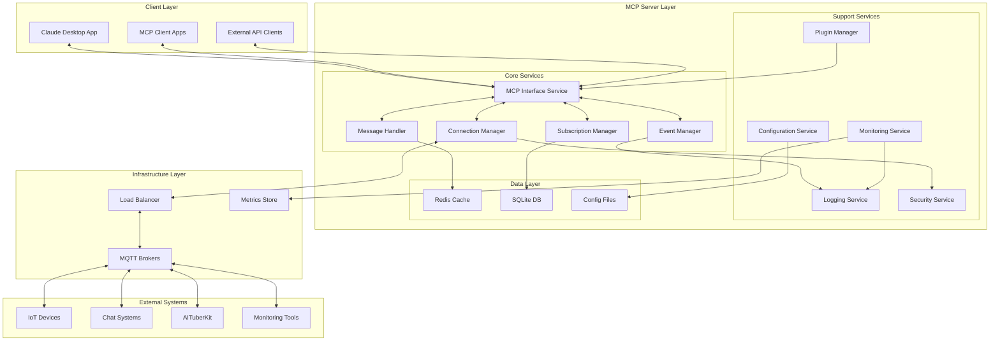

# MQTT MCP Server システム設計書

## 1. システム全体設計

### 1.1 システム構成概要



### 1.2 アーキテクチャ原則

#### 設計原則
1. **分離の原則**: 各層は明確に分離され、依存関係を最小化
2. **単一責任の原則**: 各コンポーネントは明確に定義された責任を持つ
3. **拡張性の原則**: プラグインとモジュール化による機能拡張
4. **可観測性の原則**: 全レイヤーでのログ、メトリクス、トレースの実装
5. **復旧性の原則**: 障害時の自動復旧と状態復元

#### 技術制約
- Node.js v18+ LTS基盤
- TypeScript による型安全性確保
- MCP SDK との完全互換性
- MQTT v3.1.1/5.0 プロトコル準拠
- 単一プロセス運用（スケールアウト時は複数インスタンス）

## 2. コンポーネント詳細設計

### 2.1 MCP Interface Service

#### 責務と役割
- MCPプロトコルの実装と管理
- クライアントとの通信制御
- ツール・リソース・イベントの統合管理

#### クラス設計
```typescript
export class MCPInterfaceService {
  private server: Server;
  private transport: Transport;
  private toolRegistry: ToolRegistry;
  private resourceRegistry: ResourceRegistry;
  private eventBus: EventBus;
  
  constructor(config: MCPConfig) {
    this.server = new Server({ name: config.name, version: config.version });
    this.transport = this.createTransport(config.transport);
    this.toolRegistry = new ToolRegistry();
    this.resourceRegistry = new ResourceRegistry();
    this.eventBus = new EventBus();
    
    this.setupHandlers();
  }
  
  // ツール登録・管理
  registerTool(tool: ToolDefinition): void {
    this.toolRegistry.register(tool);
    this.server.setRequestHandler(CallToolRequestSchema, this.handleToolCall.bind(this));
  }
  
  // リソース登録・管理
  registerResource(resource: ResourceDefinition): void {
    this.resourceRegistry.register(resource);
    this.server.setRequestHandler(ReadResourceRequestSchema, this.handleResourceRead.bind(this));
  }
  
  // イベント送信
  async sendEvent(event: MCPEvent): Promise<void> {
    await this.server.notification({
      method: 'notifications/message',
      params: event
    });
  }
  
  // ツール実行処理
  private async handleToolCall(request: CallToolRequest): Promise<CallToolResult> {
    const { name, arguments: args } = request.params;
    
    try {
      const tool = this.toolRegistry.get(name);
      if (!tool) {
        throw new Error(`Unknown tool: ${name}`);
      }
      
      // 引数検証
      const validationResult = this.validateArguments(tool.inputSchema, args);
      if (!validationResult.valid) {
        throw new Error(`Invalid arguments: ${validationResult.errors.join(', ')}`);
      }
      
      // ツール実行
      const result = await tool.handler(args);
      
      return {
        content: Array.isArray(result) ? result : [result],
        isError: false
      };
      
    } catch (error) {
      return {
        content: [{
          type: 'text',
          text: `Error: ${error.message}`
        }],
        isError: true
      };
    }
  }
  
  // リソース読み取り処理
  private async handleResourceRead(request: ReadResourceRequest): Promise<ReadResourceResult> {
    const { uri } = request.params;
    
    try {
      const resource = this.resourceRegistry.getByUri(uri);
      if (!resource) {
        throw new Error(`Resource not found: ${uri}`);
      }
      
      const content = await resource.handler(uri);
      
      return {
        contents: Array.isArray(content) ? content : [content]
      };
      
    } catch (error) {
      throw new Error(`Failed to read resource ${uri}: ${error.message}`);
    }
  }
}
```

### 2.2 Connection Manager

#### 責務と役割
- 複数MQTTブローカーとの接続管理
- 接続プールとロードバランシング
- 自動再接続とヘルスチェック

#### クラス設計
```typescript
export class ConnectionManager {
  private connections: Map<string, MQTTConnection>;
  private connectionPools: Map<string, ConnectionPool>;
  private healthChecker: HealthChecker;
  private reconnectManager: ReconnectManager;
  private eventEmitter: EventEmitter;
  
  constructor(config: ConnectionConfig) {
    this.connections = new Map();
    this.connectionPools = new Map();
    this.healthChecker = new HealthChecker(config.healthCheck);
    this.reconnectManager = new ReconnectManager(config.reconnect);
    this.eventEmitter = new EventEmitter();
    
    this.setupHealthChecking();
    this.setupReconnectHandling();
  }
  
  // 接続確立
  async connect(brokerConfig: BrokerConfig): Promise<ConnectionResult> {
    try {
      const connection = new MQTTConnection(brokerConfig);
      await connection.connect();
      
      this.connections.set(brokerConfig.id, connection);
      this.setupConnectionEventHandlers(connection);
      
      // 接続プール初期化
      const pool = new ConnectionPool(brokerConfig, this.config.poolSize);
      this.connectionPools.set(brokerConfig.id, pool);
      
      this.eventEmitter.emit('connected', { brokerId: brokerConfig.id });
      
      return {
        success: true,
        brokerId: brokerConfig.id,
        connectedAt: new Date()
      };
      
    } catch (error) {
      this.eventEmitter.emit('connection-failed', { 
        brokerId: brokerConfig.id, 
        error: error.message 
      });
      
      throw new ConnectionError(
        ErrorCategory.CONNECTION_ERROR,
        'CONNECTION_FAILED',
        `Failed to connect to broker ${brokerConfig.id}: ${error.message}`,
        503,
        { brokerId: brokerConfig.id, brokerUrl: brokerConfig.url }
      );
    }
  }
  
  // 接続取得（ロードバランシング対応）
  getConnection(brokerId?: string): MQTTConnection {
    if (brokerId) {
      const connection = this.connections.get(brokerId);
      if (!connection) {
        throw new Error(`Connection not found: ${brokerId}`);
      }
      return connection;
    }
    
    // デフォルトブローカーまたは最小負荷ブローカーを選択
    return this.selectBestConnection();
  }
  
  // 最適接続選択（ロードバランシング）
  private selectBestConnection(): MQTTConnection {
    const connections = Array.from(this.connections.values())
      .filter(conn => conn.isConnected())
      .sort((a, b) => a.getLoadMetric() - b.getLoadMetric());
    
    if (connections.length === 0) {
      throw new Error('No available connections');
    }
    
    return connections[0];
  }
  
  // ヘルスチェック設定
  private setupHealthChecking(): void {
    this.healthChecker.on('unhealthy', async (brokerId: string) => {
      const connection = this.connections.get(brokerId);
      if (connection) {
        await this.handleUnhealthyConnection(connection);
      }
    });
  }
  
  // 再接続処理設定
  private setupReconnectHandling(): void {
    this.reconnectManager.on('reconnect-attempt', (brokerId: string, attempt: number) => {
      this.eventEmitter.emit('reconnecting', { brokerId, attempt });
    });
    
    this.reconnectManager.on('reconnect-success', (brokerId: string) => {
      this.eventEmitter.emit('reconnected', { brokerId });
    });
    
    this.reconnectManager.on('reconnect-failed', (brokerId: string) => {
      this.eventEmitter.emit('reconnect-failed', { brokerId });
    });
  }
}

// 接続プール実装
class ConnectionPool {
  private pool: PooledConnection[];
  private available: PooledConnection[];
  private busy: PooledConnection[];
  
  constructor(private config: BrokerConfig, private maxSize: number) {
    this.pool = [];
    this.available = [];
    this.busy = [];
  }
  
  async acquire(): Promise<PooledConnection> {
    // 利用可能な接続があればそれを返す
    if (this.available.length > 0) {
      const connection = this.available.pop()!;
      this.busy.push(connection);
      return connection;
    }
    
    // プールサイズに余裕があれば新規作成
    if (this.pool.length < this.maxSize) {
      const connection = await this.createConnection();
      this.pool.push(connection);
      this.busy.push(connection);
      return connection;
    }
    
    // 利用可能になるまで待機
    return this.waitForAvailable();
  }
  
  release(connection: PooledConnection): void {
    const busyIndex = this.busy.indexOf(connection);
    if (busyIndex > -1) {
      this.busy.splice(busyIndex, 1);
      this.available.push(connection);
    }
  }
}
```

### 2.3 Message Handler

#### 責務と役割
- MQTTメッセージの送受信処理
- QoSレベル対応とメッセージ保証
- メッセージ変換とフォーマット処理

#### クラス設計
```typescript
export class MessageHandler {
  private connectionManager: ConnectionManager;
  private messageQueue: MessageQueue;
  private qosManager: QoSManager;
  private transformer: MessageTransformer;
  private duplicateFilter: DuplicateFilter;
  
  constructor(
    connectionManager: ConnectionManager,
    config: MessageHandlerConfig
  ) {
    this.connectionManager = connectionManager;
    this.messageQueue = new MessageQueue(config.queue);
    this.qosManager = new QoSManager(config.qos);
    this.transformer = new MessageTransformer(config.transformation);
    this.duplicateFilter = new DuplicateFilter(config.deduplication);
  }
  
  // メッセージ発行
  async publish(params: PublishParams): Promise<PublishResult> {
    try {
      // 接続取得
      const connection = this.connectionManager.getConnection(params.brokerId);
      
      // メッセージ変換
      const transformedMessage = await this.transformer.transform(params.message);
      
      // 重複チェック
      if (this.duplicateFilter.isDuplicate(params.topic, transformedMessage)) {
        return {
          success: true,
          messageId: this.duplicateFilter.getMessageId(params.topic, transformedMessage),
          duplicate: true
        };
      }
      
      // QoS処理
      const publishOptions = await this.qosManager.preparePublish(params);
      
      // 実際の発行
      const result = await connection.publish(
        params.topic,
        transformedMessage,
        publishOptions
      );
      
      // 統計更新
      this.updatePublishStats(params, result);
      
      return {
        success: true,
        messageId: result.messageId,
        timestamp: new Date(),
        qos: publishOptions.qos
      };
      
    } catch (error) {
      throw new MQTTError(
        ErrorCategory.PROTOCOL_ERROR,
        'PUBLISH_FAILED',
        `Failed to publish message to topic ${params.topic}: ${error.message}`,
        500,
        { topic: params.topic, brokerId: params.brokerId }
      );
    }
  }
  
  // バッチ発行
  async publishBatch(messages: PublishParams[]): Promise<BatchPublishResult> {
    const results: PublishResult[] = [];
    const errors: Array<{ index: number, error: Error }> = [];
    
    // 並列処理でスループット向上
    const promises = messages.map(async (message, index) => {
      try {
        const result = await this.publish(message);
        results[index] = result;
      } catch (error) {
        errors.push({ index, error: error as Error });
      }
    });
    
    await Promise.allSettled(promises);
    
    return {
      successCount: results.filter(r => r?.success).length,
      errorCount: errors.length,
      results,
      errors
    };
  }
  
  // 受信メッセージ処理
  async handleIncomingMessage(
    topic: string,
    payload: Buffer,
    packet: IPublishPacket
  ): Promise<void> {
    try {
      // QoS確認応答処理
      await this.qosManager.handleIncoming(packet);
      
      // メッセージデコード
      const message = await this.transformer.decode(payload, packet.properties);
      
      // 重複フィルタリング
      if (this.duplicateFilter.isDuplicate(topic, message, packet.messageId)) {
        return; // 重複メッセージは無視
      }
      
      // メッセージオブジェクト作成
      const mqttMessage: MQTTMessage = {
        topic,
        payload: message,
        qos: packet.qos || 0,
        retain: packet.retain || false,
        messageId: packet.messageId,
        timestamp: Date.now(),
        properties: packet.properties
      };
      
      // イベントとして通知
      this.eventEmitter.emit('message-received', mqttMessage);
      
      // 統計更新
      this.updateReceiveStats(mqttMessage);
      
    } catch (error) {
      console.error('Failed to handle incoming message:', error);
      this.eventEmitter.emit('message-error', { topic, error });
    }
  }
}

// QoS管理
class QoSManager {
  private pendingQoS1: Map<number, PendingMessage>;
  private pendingQoS2: Map<number, PendingMessage>;
  
  constructor(private config: QoSConfig) {
    this.pendingQoS1 = new Map();
    this.pendingQoS2 = new Map();
    
    this.setupTimeouts();
  }
  
  async preparePublish(params: PublishParams): Promise<PublishOptions> {
    const options: PublishOptions = {
      qos: params.qos || 0,
      retain: params.retain || false,
      dup: false
    };
    
    // QoS 1/2の場合はメッセージIDを生成
    if (options.qos > 0) {
      options.messageId = this.generateMessageId();
      
      // pending管理に追加
      const pendingMessage: PendingMessage = {
        messageId: options.messageId,
        topic: params.topic,
        payload: params.message,
        timestamp: Date.now(),
        retryCount: 0
      };
      
      if (options.qos === 1) {
        this.pendingQoS1.set(options.messageId, pendingMessage);
      } else if (options.qos === 2) {
        this.pendingQoS2.set(options.messageId, pendingMessage);
      }
    }
    
    return options;
  }
  
  async handleIncoming(packet: IPublishPacket): Promise<void> {
    if (packet.qos === 1 && packet.messageId) {
      // QoS 1: PUBACK送信
      await this.sendPubAck(packet.messageId);
    } else if (packet.qos === 2 && packet.messageId) {
      // QoS 2: PUBREC送信
      await this.sendPubRec(packet.messageId);
    }
  }
  
  // タイムアウト処理
  private setupTimeouts(): void {
    setInterval(() => {
      const now = Date.now();
      
      // QoS 1 タイムアウトチェック
      for (const [messageId, pending] of this.pendingQoS1) {
        if (now - pending.timestamp > this.config.timeoutMs) {
          this.handleTimeout(messageId, pending, 1);
        }
      }
      
      // QoS 2 タイムアウトチェック
      for (const [messageId, pending] of this.pendingQoS2) {
        if (now - pending.timestamp > this.config.timeoutMs) {
          this.handleTimeout(messageId, pending, 2);
        }
      }
    }, this.config.checkIntervalMs);
  }
  
  private async handleTimeout(
    messageId: number,
    pending: PendingMessage,
    qos: number
  ): Promise<void> {
    if (pending.retryCount < this.config.maxRetries) {
      // リトライ
      pending.retryCount++;
      pending.timestamp = Date.now();
      await this.retryMessage(pending, qos);
    } else {
      // 最大リトライ数到達
      if (qos === 1) {
        this.pendingQoS1.delete(messageId);
      } else {
        this.pendingQoS2.delete(messageId);
      }
      
      this.eventEmitter.emit('message-timeout', { messageId, pending });
    }
  }
}
```

### 2.4 Subscription Manager

#### 責務と役割
- トピック購読の管理
- ワイルドカードパターンマッチング
- メッセージルーティング

#### クラス設計
```typescript
export class SubscriptionManager {
  private subscriptions: Map<string, Subscription>;
  private topicTree: TopicTree;
  private filterChain: FilterChain;
  private routingTable: RoutingTable;
  
  constructor(config: SubscriptionConfig) {
    this.subscriptions = new Map();
    this.topicTree = new TopicTree();
    this.filterChain = new FilterChain(config.filters);
    this.routingTable = new RoutingTable();
  }
  
  // 購読登録
  async subscribe(params: SubscribeParams): Promise<SubscribeResult> {
    try {
      const connection = this.connectionManager.getConnection(params.brokerId);
      
      // 購読実行
      const mqttResult = await connection.subscribe(params.topic, {
        qos: params.qos || 0
      });
      
      // 内部管理に追加
      const subscription: Subscription = {
        id: this.generateSubscriptionId(),
        brokerId: params.brokerId || 'default',
        topic: params.topic,
        qos: params.qos || 0,
        createdAt: new Date(),
        messageCount: 0,
        lastMessage: null
      };
      
      this.subscriptions.set(subscription.id, subscription);
      this.topicTree.add(params.topic, subscription);
      
      return {
        success: true,
        subscriptionId: subscription.id,
        grantedQoS: mqttResult.qos
      };
      
    } catch (error) {
      throw new MQTTError(
        ErrorCategory.PROTOCOL_ERROR,
        'SUBSCRIBE_FAILED',
        `Failed to subscribe to topic ${params.topic}: ${error.message}`,
        500,
        { topic: params.topic, brokerId: params.brokerId }
      );
    }
  }
  
  // 複数購読
  async subscribeMultiple(
    subscriptions: SubscribeParams[]
  ): Promise<BatchSubscribeResult> {
    const results: SubscribeResult[] = [];
    const errors: Array<{ index: number, error: Error }> = [];
    
    for (let i = 0; i < subscriptions.length; i++) {
      try {
        const result = await this.subscribe(subscriptions[i]);
        results[i] = result;
      } catch (error) {
        errors.push({ index: i, error: error as Error });
      }
    }
    
    return {
      successCount: results.filter(r => r?.success).length,
      errorCount: errors.length,
      results,
      errors
    };
  }
  
  // メッセージルーティング
  routeMessage(topic: string, message: MQTTMessage): void {
    // マッチする購読を検索
    const matchedSubscriptions = this.topicTree.match(topic);
    
    for (const subscription of matchedSubscriptions) {
      // フィルターチェーン適用
      const filteredMessage = this.filterChain.apply(message, subscription);
      if (filteredMessage) {
        // ルーティング実行
        this.routingTable.route(filteredMessage, subscription);
        
        // 統計更新
        subscription.messageCount++;
        subscription.lastMessage = new Date();
      }
    }
  }
}

// トピックツリー（効率的なパターンマッチング）
class TopicTree {
  private root: TopicNode;
  
  constructor() {
    this.root = new TopicNode('');
  }
  
  add(topicPattern: string, subscription: Subscription): void {
    const parts = topicPattern.split('/');
    let current = this.root;
    
    for (const part of parts) {
      if (!current.children.has(part)) {
        current.children.set(part, new TopicNode(part));
      }
      current = current.children.get(part)!;
    }
    
    current.subscriptions.add(subscription);
  }
  
  match(topic: string): Set<Subscription> {
    const parts = topic.split('/');
    const matches = new Set<Subscription>();
    
    this.matchRecursive(this.root, parts, 0, matches);
    
    return matches;
  }
  
  private matchRecursive(
    node: TopicNode,
    topicParts: string[],
    index: number,
    matches: Set<Subscription>
  ): void {
    // 終端に到達
    if (index === topicParts.length) {
      for (const subscription of node.subscriptions) {
        matches.add(subscription);
      }
      return;
    }
    
    const currentPart = topicParts[index];
    
    // 完全一致
    if (node.children.has(currentPart)) {
      this.matchRecursive(node.children.get(currentPart)!, topicParts, index + 1, matches);
    }
    
    // 単一レベルワイルドカード '+'
    if (node.children.has('+')) {
      this.matchRecursive(node.children.get('+')!, topicParts, index + 1, matches);
    }
    
    // マルチレベルワイルドカード '#'
    if (node.children.has('#')) {
      const wildcardNode = node.children.get('#')!;
      for (const subscription of wildcardNode.subscriptions) {
        matches.add(subscription);
      }
    }
  }
}

class TopicNode {
  children: Map<string, TopicNode>;
  subscriptions: Set<Subscription>;
  
  constructor(public name: string) {
    this.children = new Map();
    this.subscriptions = new Set();
  }
}
```

### 2.5 Event Manager

#### 責務と役割
- システムイベントの管理
- MCPクライアントへの通知
- イベント履歴とバッファリング

#### クラス設計
```typescript
export class EventManager {
  private eventBus: EventEmitter;
  private mcpInterface: MCPInterfaceService;
  private eventBuffer: CircularBuffer<SystemEvent>;
  private eventFilters: EventFilter[];
  private eventHistory: EventHistory;
  
  constructor(
    mcpInterface: MCPInterfaceService,
    config: EventManagerConfig
  ) {
    this.eventBus = new EventEmitter();
    this.mcpInterface = mcpInterface;
    this.eventBuffer = new CircularBuffer(config.bufferSize);
    this.eventFilters = [];
    this.eventHistory = new EventHistory(config.historySize);
    
    this.setupEventHandlers();
  }
  
  // イベント発行
  emit(eventType: EventType, data: any): void {
    const event: SystemEvent = {
      id: this.generateEventId(),
      type: eventType,
      timestamp: Date.now(),
      data,
      metadata: {
        source: 'mqtt-mcp-server',
        version: this.config.version
      }
    };
    
    // フィルター適用
    if (this.shouldEmitEvent(event)) {
      this.eventBus.emit(eventType, event);
      this.eventBuffer.push(event);
      this.eventHistory.add(event);
      
      // MCPクライアントに通知
      this.notifyMCPClients(event);
    }
  }
  
  // MCPクライアント通知
  private async notifyMCPClients(event: SystemEvent): Promise<void> {
    try {
      const mcpEvent = this.convertToMCPEvent(event);
      await this.mcpInterface.sendEvent(mcpEvent);
    } catch (error) {
      console.error('Failed to notify MCP clients:', error);
    }
  }
  
  // システムイベント → MCPイベント変換
  private convertToMCPEvent(event: SystemEvent): MCPEvent {
    switch (event.type) {
      case EventType.MESSAGE_RECEIVED:
        return {
          type: 'mqtt_message',
          data: {
            brokerId: event.data.brokerId,
            topic: event.data.topic,
            message: event.data.payload,
            qos: event.data.qos,
            retain: event.data.retain,
            timestamp: event.timestamp
          }
        };
        
      case EventType.CONNECTION_ESTABLISHED:
      case EventType.CONNECTION_LOST:
        return {
          type: 'mqtt_connection',
          data: {
            brokerId: event.data.brokerId,
            status: event.type === EventType.CONNECTION_ESTABLISHED ? 'connected' : 'disconnected',
            timestamp: event.timestamp
          }
        };
        
      case EventType.ERROR_OCCURRED:
        return {
          type: 'mqtt_error',
          data: {
            brokerId: event.data.brokerId,
            operation: event.data.operation,
            error: {
              code: event.data.code,
              message: event.data.message
            },
            timestamp: event.timestamp
          }
        };
        
      default:
        return {
          type: 'system_event',
          data: event.data
        };
    }
  }
  
  // イベントフィルター
  private shouldEmitEvent(event: SystemEvent): boolean {
    return this.eventFilters.every(filter => filter.accept(event));
  }
  
  // イベントハンドラー設定
  private setupEventHandlers(): void {
    // 接続イベント
    this.eventBus.on(EventType.CONNECTION_ESTABLISHED, (event) => {
      console.log(`Connection established: ${event.data.brokerId}`);
    });
    
    this.eventBus.on(EventType.CONNECTION_LOST, (event) => {
      console.warn(`Connection lost: ${event.data.brokerId}`);
    });
    
    // メッセージイベント
    this.eventBus.on(EventType.MESSAGE_RECEIVED, (event) => {
      console.debug(`Message received on topic: ${event.data.topic}`);
    });
    
    // エラーイベント
    this.eventBus.on(EventType.ERROR_OCCURRED, (event) => {
      console.error(`Error occurred: ${event.data.message}`);
    });
  }
}

// イベント履歴管理
class EventHistory {
  private events: SystemEvent[];
  private maxSize: number;
  private indices: Map<string, number[]>; // タイプ別インデックス
  
  constructor(maxSize: number) {
    this.events = [];
    this.maxSize = maxSize;
    this.indices = new Map();
  }
  
  add(event: SystemEvent): void {
    // サイズ制限チェック
    if (this.events.length >= this.maxSize) {
      const removed = this.events.shift()!;
      this.removeFromIndices(removed, 0);
      
      // インデックス調整
      for (const [type, indices] of this.indices) {
        this.indices.set(type, indices.map(i => i - 1).filter(i => i >= 0));
      }
    }
    
    // 追加
    const index = this.events.length;
    this.events.push(event);
    
    // インデックス更新
    if (!this.indices.has(event.type)) {
      this.indices.set(event.type, []);
    }
    this.indices.get(event.type)!.push(index);
  }
  
  query(filter: EventFilter): SystemEvent[] {
    let results = this.events;
    
    // タイプフィルター
    if (filter.types && filter.types.length > 0) {
      const typeIndices = new Set<number>();
      for (const type of filter.types) {
        const indices = this.indices.get(type) || [];
        indices.forEach(i => typeIndices.add(i));
      }
      results = Array.from(typeIndices).map(i => this.events[i]);
    }
    
    // 時間フィルター
    if (filter.startTime) {
      results = results.filter(e => e.timestamp >= filter.startTime!);
    }
    if (filter.endTime) {
      results = results.filter(e => e.timestamp <= filter.endTime!);
    }
    
    // 制限
    if (filter.limit) {
      results = results.slice(-filter.limit);
    }
    
    return results.sort((a, b) => a.timestamp - b.timestamp);
  }
}
```

## 3. データ設計

### 3.1 データモデル

#### 接続情報
```typescript
interface ConnectionInfo {
  id: string;
  brokerUrl: string;
  protocol: 'mqtt' | 'mqtts' | 'ws' | 'wss';
  status: ConnectionStatus;
  config: BrokerConfig;
  metrics: ConnectionMetrics;
  createdAt: Date;
  connectedAt?: Date;
  lastActivity: Date;
  error?: ErrorInfo;
}

interface ConnectionMetrics {
  messagesSent: number;
  messagesReceived: number;
  bytesTransferred: number;
  packetsLost: number;
  averageLatency: number;
  currentLatency: number;
  reconnectCount: number;
  uptime: number; // seconds
  throughput: number; // messages/second
}
```

#### 購読情報
```typescript
interface Subscription {
  id: string;
  brokerId: string;
  topic: string;
  qos: 0 | 1 | 2;
  active: boolean;
  createdAt: Date;
  lastActivity?: Date;
  messageCount: number;
  errorCount: number;
  filters: MessageFilter[];
}

interface MessageFilter {
  type: 'content' | 'source' | 'size' | 'rate';
  condition: string;
  action: 'allow' | 'deny' | 'transform';
  parameters?: any;
}
```

#### メッセージ履歴
```typescript
interface MessageRecord {
  id: string;
  brokerId: string;
  topic: string;
  payload: any;
  qos: 0 | 1 | 2;
  retain: boolean;
  messageId?: number;
  size: number;
  timestamp: Date;
  direction: 'inbound' | 'outbound';
  processingTime?: number;
  metadata?: Record<string, any>;
}
```

### 3.2 データストレージ設計

#### SQLiteスキーマ
```sql
-- 接続情報テーブル
CREATE TABLE connections (
  id TEXT PRIMARY KEY,
  broker_url TEXT NOT NULL,
  protocol TEXT NOT NULL,
  status TEXT NOT NULL,
  config TEXT NOT NULL, -- JSON
  metrics TEXT NOT NULL, -- JSON
  created_at DATETIME NOT NULL,
  connected_at DATETIME,
  last_activity DATETIME NOT NULL,
  error_info TEXT -- JSON
);

-- 購読情報テーブル
CREATE TABLE subscriptions (
  id TEXT PRIMARY KEY,
  broker_id TEXT NOT NULL,
  topic TEXT NOT NULL,
  qos INTEGER NOT NULL,
  active BOOLEAN NOT NULL DEFAULT 1,
  created_at DATETIME NOT NULL,
  last_activity DATETIME,
  message_count INTEGER NOT NULL DEFAULT 0,
  error_count INTEGER NOT NULL DEFAULT 0,
  filters TEXT, -- JSON
  FOREIGN KEY (broker_id) REFERENCES connections(id)
);

-- メッセージ履歴テーブル
CREATE TABLE message_history (
  id TEXT PRIMARY KEY,
  broker_id TEXT NOT NULL,
  topic TEXT NOT NULL,
  payload BLOB NOT NULL,
  qos INTEGER NOT NULL,
  retain BOOLEAN NOT NULL,
  message_id INTEGER,
  size INTEGER NOT NULL,
  timestamp DATETIME NOT NULL,
  direction TEXT NOT NULL,
  processing_time INTEGER,
  metadata TEXT, -- JSON
  FOREIGN KEY (broker_id) REFERENCES connections(id)
);

-- インデックス
CREATE INDEX idx_subscriptions_broker_topic ON subscriptions(broker_id, topic);
CREATE INDEX idx_message_history_broker_timestamp ON message_history(broker_id, timestamp);
CREATE INDEX idx_message_history_topic_timestamp ON message_history(topic, timestamp);
```

#### Redis キャッシュ設計
```typescript
// キー設計
const CacheKeys = {
  CONNECTION_STATUS: (brokerId: string) => `conn:status:${brokerId}`,
  MESSAGE_BUFFER: (brokerId: string) => `msg:buffer:${brokerId}`,
  SUBSCRIPTION_LIST: (brokerId: string) => `sub:list:${brokerId}`,
  METRICS: (brokerId: string) => `metrics:${brokerId}`,
  RATE_LIMIT: (clientId: string) => `rate:${clientId}`,
  DUPLICATE_CHECK: (topic: string) => `dup:${topic}`
};

// データ構造
interface CachedMessage {
  topic: string;
  payload: string;
  qos: number;
  timestamp: number;
  ttl: number;
}

interface CachedMetrics {
  messageCount: number;
  errorCount: number;
  lastUpdate: number;
  throughput: number;
}
```

## 4. セキュリティ設計

### 4.1 認証・認可アーキテクチャ

```typescript
// セキュリティマネージャー
export class SecurityManager {
  private authProviders: Map<string, AuthProvider>;
  private authzEngine: AuthorizationEngine;
  private cryptoService: CryptoService;
  private auditLogger: AuditLogger;
  
  constructor(config: SecurityConfig) {
    this.authProviders = new Map();
    this.authzEngine = new AuthorizationEngine(config.authorization);
    this.cryptoService = new CryptoService(config.encryption);
    this.auditLogger = new AuditLogger(config.audit);
    
    this.registerAuthProviders(config.authentication);
  }
  
  // 認証
  async authenticate(credentials: Credentials): Promise<AuthResult> {
    const provider = this.authProviders.get(credentials.type);
    if (!provider) {
      throw new Error(`Unsupported auth type: ${credentials.type}`);
    }
    
    try {
      const result = await provider.authenticate(credentials);
      
      // 監査ログ
      this.auditLogger.logAuthAttempt({
        type: credentials.type,
        success: result.success,
        principal: result.principal,
        timestamp: Date.now()
      });
      
      return result;
      
    } catch (error) {
      this.auditLogger.logAuthFailure({
        type: credentials.type,
        error: error.message,
        timestamp: Date.now()
      });
      throw error;
    }
  }
  
  // 認可
  authorize(
    principal: Principal,
    resource: Resource,
    action: Action
  ): boolean {
    const result = this.authzEngine.authorize(principal, resource, action);
    
    // 監査ログ
    this.auditLogger.logAuthzCheck({
      principal: principal.id,
      resource: resource.uri,
      action,
      granted: result,
      timestamp: Date.now()
    });
    
    return result;
  }
  
  // 機密情報暗号化
  encrypt(plaintext: string): string {
    return this.cryptoService.encrypt(plaintext);
  }
  
  decrypt(ciphertext: string): string {
    return this.cryptoService.decrypt(ciphertext);
  }
}

// 認証プロバイダー
interface AuthProvider {
  type: string;
  authenticate(credentials: Credentials): Promise<AuthResult>;
}

class UsernamePasswordAuthProvider implements AuthProvider {
  type = 'username-password';
  
  async authenticate(credentials: UsernamePasswordCredentials): Promise<AuthResult> {
    // パスワード検証ロジック
    const isValid = await this.verifyPassword(credentials.username, credentials.password);
    
    if (isValid) {
      return {
        success: true,
        principal: {
          id: credentials.username,
          type: 'user',
          roles: await this.getUserRoles(credentials.username)
        }
      };
    } else {
      return {
        success: false,
        error: 'Invalid credentials'
      };
    }
  }
}
```

### 4.2 TLS/SSL設定

```typescript
// TLS設定管理
export class TLSManager {
  private certificates: Map<string, Certificate>;
  private tlsOptions: TLSOptions;
  
  constructor(config: TLSConfig) {
    this.certificates = new Map();
    this.tlsOptions = this.buildTLSOptions(config);
    
    this.loadCertificates(config.certificates);
  }
  
  createSecureContext(brokerId: string): SecureContext {
    const cert = this.certificates.get(brokerId);
    if (!cert) {
      throw new Error(`Certificate not found for broker: ${brokerId}`);
    }
    
    return tls.createSecureContext({
      cert: cert.cert,
      key: cert.key,
      ca: cert.ca,
      ciphers: this.tlsOptions.ciphers,
      secureProtocol: this.tlsOptions.protocol
    });
  }
  
  private buildTLSOptions(config: TLSConfig): TLSOptions {
    return {
      minVersion: config.minVersion || 'TLSv1.2',
      maxVersion: config.maxVersion || 'TLSv1.3',
      ciphers: config.ciphers || this.getSecureCiphers(),
      protocol: config.protocol || 'TLS_method',
      rejectUnauthorized: config.rejectUnauthorized !== false
    };
  }
  
  private getSecureCiphers(): string {
    return [
      'ECDHE-RSA-AES128-GCM-SHA256',
      'ECDHE-RSA-AES256-GCM-SHA384',
      'ECDHE-RSA-AES128-SHA256',
      'ECDHE-RSA-AES256-SHA384'
    ].join(':');
  }
}
```

## 5. 監視・運用設計

### 5.1 メトリクス設計

```typescript
// メトリクス収集
export class MetricsCollector {
  private metrics: Map<string, Metric>;
  private collectors: MetricCollector[];
  
  constructor() {
    this.metrics = new Map();
    this.collectors = [];
    
    this.setupSystemMetrics();
    this.setupMQTTMetrics();
    this.setupMCPMetrics();
  }
  
  // システムメトリクス
  private setupSystemMetrics(): void {
    this.registerMetric('system_uptime', {
      type: 'gauge',
      description: 'System uptime in seconds',
      collect: () => process.uptime()
    });
    
    this.registerMetric('memory_usage', {
      type: 'gauge',
      description: 'Memory usage in bytes',
      collect: () => process.memoryUsage().heapUsed
    });
    
    this.registerMetric('cpu_usage', {
      type: 'gauge',
      description: 'CPU usage percentage',
      collect: () => this.getCPUUsage()
    });
  }
  
  // MQTTメトリクス
  private setupMQTTMetrics(): void {
    this.registerMetric('mqtt_connections_total', {
      type: 'gauge',
      description: 'Number of MQTT connections',
      labels: ['broker_id', 'status']
    });
    
    this.registerMetric('mqtt_messages_total', {
      type: 'counter',
      description: 'Total MQTT messages',
      labels: ['broker_id', 'direction', 'qos']
    });
    
    this.registerMetric('mqtt_message_latency', {
      type: 'histogram',
      description: 'MQTT message processing latency',
      labels: ['broker_id'],
      buckets: [1, 5, 10, 25, 50, 100, 250, 500, 1000]
    });
  }
  
  // メトリクス出力
  exportPrometheus(): string {
    let output = '';
    
    for (const [name, metric] of this.metrics) {
      output += `# HELP ${name} ${metric.description}\n`;
      output += `# TYPE ${name} ${metric.type}\n`;
      
      const value = metric.collect();
      if (metric.labels) {
        // ラベル付きメトリクス
        for (const [labelValues, metricValue] of value) {
          const labels = metric.labels.map((label, i) => `${label}="${labelValues[i]}"`).join(',');
          output += `${name}{${labels}} ${metricValue}\n`;
        }
      } else {
        // 単純メトリクス
        output += `${name} ${value}\n`;
      }
      
      output += '\n';
    }
    
    return output;
  }
}
```

### 5.2 ヘルスチェック設計

```typescript
// ヘルスチェック
export class HealthChecker {
  private checks: Map<string, HealthCheck>;
  private cache: Map<string, HealthResult>;
  private cacheTimeout = 30000; // 30秒
  
  constructor() {
    this.checks = new Map();
    this.cache = new Map();
    
    this.registerSystemChecks();
    this.registerMQTTChecks();
  }
  
  // システムチェック
  private registerSystemChecks(): void {
    this.checks.set('memory', {
      name: 'Memory Usage',
      check: async () => {
        const usage = process.memoryUsage();
        const usagePercent = (usage.heapUsed / usage.heapTotal) * 100;
        
        if (usagePercent > 90) {
          return { status: 'unhealthy', message: 'Memory usage too high' };
        } else if (usagePercent > 80) {
          return { status: 'degraded', message: 'Memory usage high' };
        } else {
          return { status: 'healthy', message: 'Memory usage normal' };
        }
      }
    });
    
    this.checks.set('disk', {
      name: 'Disk Space',
      check: async () => {
        const stats = await fs.promises.statfs('.');
        const freePercent = (stats.bavail / stats.blocks) * 100;
        
        if (freePercent < 5) {
          return { status: 'unhealthy', message: 'Disk space critically low' };
        } else if (freePercent < 15) {
          return { status: 'degraded', message: 'Disk space low' };
        } else {
          return { status: 'healthy', message: 'Disk space sufficient' };
        }
      }
    });
  }
  
  // MQTTチェック
  private registerMQTTChecks(): void {
    this.checks.set('mqtt_connectivity', {
      name: 'MQTT Connectivity',
      check: async () => {
        const connections = this.connectionManager.getAllConnections();
        const healthyCount = Array.from(connections.values())
          .filter(conn => conn.isConnected()).length;
        const totalCount = connections.size;
        
        if (healthyCount === 0 && totalCount > 0) {
          return { status: 'unhealthy', message: 'No MQTT connections available' };
        } else if (healthyCount < totalCount) {
          return { 
            status: 'degraded', 
            message: `${healthyCount}/${totalCount} MQTT connections healthy` 
          };
        } else {
          return { status: 'healthy', message: 'All MQTT connections healthy' };
        }
      }
    });
  }
  
  // 総合ヘルスチェック
  async checkHealth(): Promise<OverallHealth> {
    const results = new Map<string, HealthResult>();
    
    for (const [name, check] of this.checks) {
      try {
        const cached = this.cache.get(name);
        if (cached && Date.now() - cached.timestamp < this.cacheTimeout) {
          results.set(name, cached);
        } else {
          const result = await check.check();
          result.timestamp = Date.now();
          this.cache.set(name, result);
          results.set(name, result);
        }
      } catch (error) {
        results.set(name, {
          status: 'unhealthy',
          message: `Health check failed: ${error.message}`,
          timestamp: Date.now()
        });
      }
    }
    
    // 総合ステータス決定
    const statuses = Array.from(results.values()).map(r => r.status);
    let overallStatus: HealthStatus = 'healthy';
    
    if (statuses.includes('unhealthy')) {
      overallStatus = 'unhealthy';
    } else if (statuses.includes('degraded')) {
      overallStatus = 'degraded';
    }
    
    return {
      status: overallStatus,
      timestamp: Date.now(),
      checks: Object.fromEntries(results),
      uptime: process.uptime(),
      version: this.config.version
    };
  }
}
```

---

**版数**: 1.0  
**作成日**: 2024年12月15日  
**承認者**: システムアーキテクト  
**次回レビュー**: 2025年3月15日